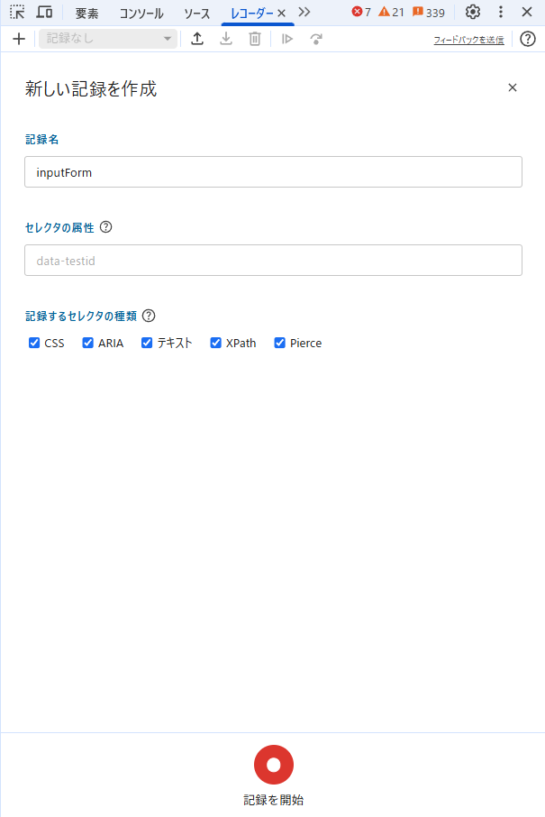

# Puppeteer Sample Project

# プロジェクトの概要

このプロジェクトは、Puppeteer を使用したブラウザ自動化のサンプルプロジェクト。
自動化の手順は Windows でも Mac でも大きくは代わらないが、ここでは Windows を前提としてショートカットキーなどを記載する。

# 開発環境のセットアップ

node が install されていなければ、 https://nodejs.org/ja からダウンロード&インストールする。
ターミナルで以下コマンドを実行

```bash
# 依存パッケージのインストール
npm install

# ビルドと実行
npm start src/ファイル名.js
```

# ファイル/フォルダ構成

## フォルダの役割

3 段階の粒度でまとめている。上から順に大きな粒度。

1. scenario
   自動化したい一番大きなファイルの置き場。
   Chrome の開発者ツール（Recorder タブ）からダウンロードした js ファイルを置く。
   必要に応じて Browser オブジェクトの取得など、一部の処理を置き換える。

2. action
   scenario の内、自動化対象の処理の共通部を切り出したファイルの置き場。
   例：Web サービスへのログイン処理、特定画面への移動

3. utilimage.png
   action よりも細かい単位で共通部を切り出したファイルの置き場。
   例：Browser の初期化処理、特定要素の表示待ち、確認用モーダルのクローズ

## ファイル形式の違いについて

Chrome の開発者ツールでダウンロードした puppeteer のコードは、javaScript ファイルなので、ファイルは javaScript で統一。

# 自動化の手順

## 作業の流れ

1. Chrome の開発者ツールを開く
   Windows だと、 `F12` か `Ctrl` + `Shift` + `I` で開発者ツールを開く。

2. Recorder タブを開く

3. 記録を開始する +ボタンを押して、記録名に任意の名前を付けて「記録を開始」を押す。

    

    ※記録名は js ファイルの名前になるので、キャメルケースなど命名を統一するとよい。

    ※「セレクタの属性」「記録するセレクタの種類」はデフォルトでも問題ない。
    セレクタとは、クリックや値の入力対象となる要素を特定するために使う識別用の情報。例えば、class や id といった属性を使用する。

    - セレクタの属性…　「記録するセレクタの種類」以外の方法でセレクタを指定する場合に指定する。独自の属性を付与している場合などに使う。

    - 記録するセレクタの属性…　選択した方法で要素を選ぶ。複数チェックを入れた状態で、操作対象を特定するためのセレクタが複数記述可能な場合は、全て候補として使用できるため、意図がなければ全チェックのままでよい。

    例：

    ```
    <div id='login-button'>ログインする</div>
    という要素を操作したい場合、以下のようなセレクタの指定が考えられる。
    xpath///*[@id="login-button"] -> idがlogin-buttonである要素
    text/ログインする -> 中のテキストが「ログインする」である要素
    ```

4. 自動化したい操作を記録する

5. エクスポートアイコンを押して js ファイルをダウンロードする
   ※形式は複数選べるが、Puppeteer を選ぶ。

6. ダウンロードした js ファイルをプロジェクトの src/scenario フォルダに配置する

7. js ファイルの必要な箇所を書き換える
   ※最低限、下記の箇所は書き換えることを勧める。
   // TODO: 後で記載する
    1. a
    2. b
    3. c

## 自動化時の TIPS

-   フレーム内の要素を操作する場合は、別途 Frame オブジェクトから操作する必要がある。
    例えば、以下のような構造の場合。

```html
<body>
    <iframe>
        <iframe>
            <div>何らかの要素</div>
        </iframe>
    </iframe>
</body>
```

以下のように、outerFrame の中で更に innerFrame のオブジェクトを取得して操作する必要がある。

```js
const page = await browser.newPage();
const mainFrame = page.mainFrame(); // mainFrameはiframeとは別。メインページ自体を表す。
const outerFrame = mainFrame.childFrames()[0];
const innerFrame = outerFrame.childFrames()[0];
```

// TODO: 後で追記する

## Recorder から出力されたコードの誤り例

2025/05/07 時点で、Recorder から出力されたコードそのままだと動かないパターンを参考までに記載する。

-   2 重にネストされた iframe 内の要素の操作をする場合
    　※内側の iframe を Frame オブジェクトとして取得する必要があるが、外側の iframe を取得して操作するコードになっていた

-   不要な待ち処理が追加されている場合
    　※満たされない条件で定義された waitForTarget の戻り値が undefined になり、エラーになるパターン

// TODO: 後で処理を共通化したり、別のパターン（GoogleForm とかローカルの変わったページ）の自動化コードを追加したい
